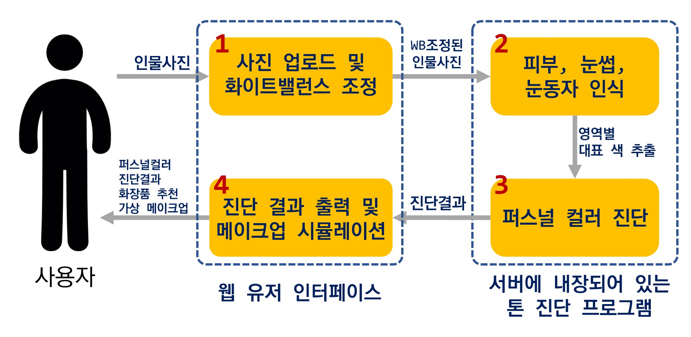
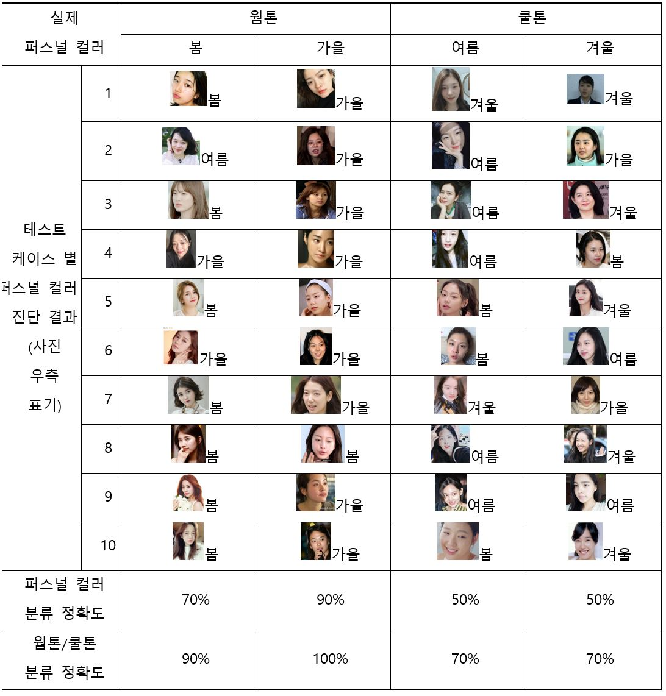
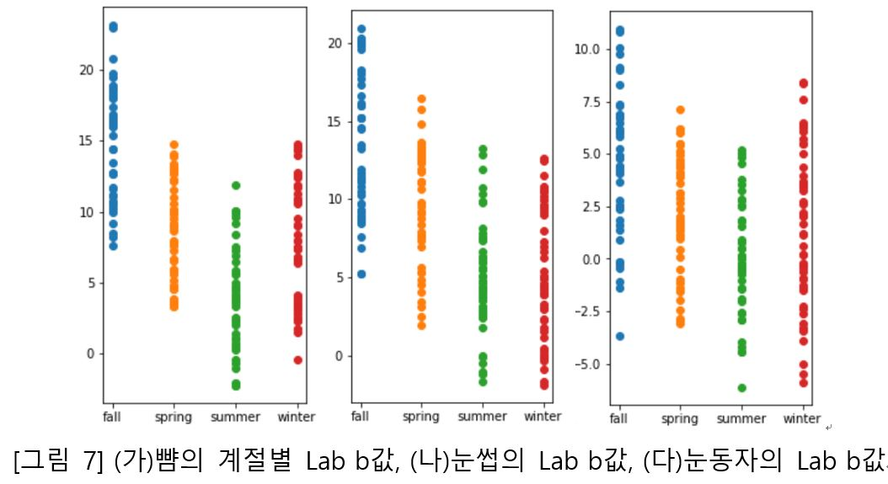
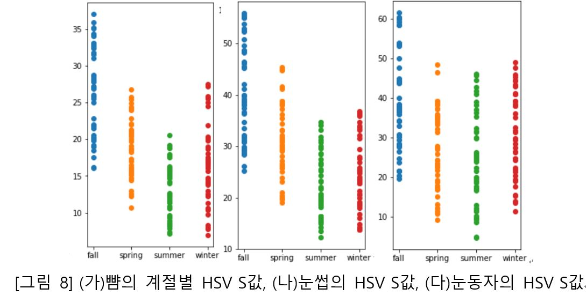
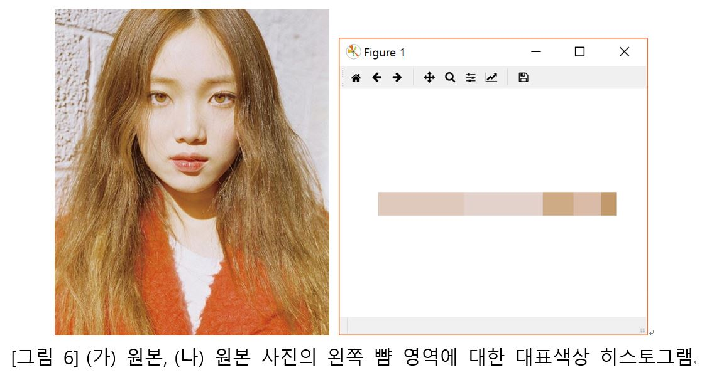

# Show me the color
This is Personal color diagnosis system.

 **Click this image to see the Demo video!**
## Caution
This source code only covers personal color diagnosis. It doesn't have web framework, white balance adjust, and virtual makeup code. It is because I only contributed the personal color diagnosis feature in this team project!  
이 소스코드는 퍼스널 컬러 진단 기능만 다룹니다. 데모에서 보여드린 것처럼 웹 프레임워크나 화이트 밸런스 조정 기능, 그리고 가상 메이크업 시뮬레이션 코드는 없습니다. 팀 프로젝트에서 제 파트가 아니었거든요!

## Usage
First of all, `git clone` to download the source code.

`cd src`
- Analysis a single image 
`python main.py --image IMAGEPATH`
- Analysis multiple images in a directory 
`python main.py --dir DIRECTORYPATH` 

 You have to install `imutils` and `opencv`, `dlib` packages.   

먼저 `git clone` 을 통해 다운로드 받습니다.

`cd src` 
- 사진 한개의 퍼스널컬러 진단하기 
`python main.py --image IMAGEPATH`
- 여러 개의 사진이 담긴 디렉토리 한꺼번에 진단하기 
`python main.py --dir DIRECTORYPATH` 

 `imutils` 와 `opencv`, `dlib` packages를 설치해야 합니다. (pip install)  

# 요약
퍼스널 컬러는 타고난 신체색상을 말하며, 피부, 눈동자, 머리카락의 색채로서 각자가 타고난 그대로의 색을 말합니다. 의류, 화장 및 머리 색상을 선택할 때 개인에게 적합한 퍼스널 컬러를 활용하는 경우 이미지 개선에 탁월한 효과를 보입니다. 이를 위해 사진 업로드를 통해 퍼스널 컬러를 진단하는 웹 서비스를 개발하였습니다. OpenCV와 Dlib 라이브러리를 이용한 이미지 분석을 통해 인물 사진에서 눈동자, 머리카락, 뺨 영역을 인식하였고 인식한 영역에 대하여 k-means 알고리즘을 통해 각 영역의 대표 색상을 추출하였습니다. 추출한 대표 색상을 본 연구에서 개발한 퍼스널 컬러 진단 알고리즘을 이용하여 봄, 여름, 가을, 겨울 중 하나로 진단하고 해당 퍼스널컬러에 어울리는 립스틱 색상을 추천합니다. 진단 및 추천 결과를 웹 상으로 출력하여 사용자가 볼 수 있습니다.

### 전체 시스템

사용자가 웹사이트에 사진을 업로드하면 본 시스템이 사진을 분석하여 퍼스널 컬러 진단 결과 및 추천 화장품을 적용한 가상 메이크업 시뮬레이션을 사용자에게 제공하는 구조입니다.

### 퍼스널 컬러 진단 알고리즘

질의 사진의 뺨, 눈동자, 눈썹의 Lab b값을 계산했다면 웜톤 또는 쿨톤으로 분류합니다. 웜톤이라면 HSV S값을 이용해 봄 또는 가을로, 쿨톤이라면 HSV S값을 이용해 여름 또는 겨울로 분류합니다. 
퍼스널컬러 분류 작업은 질의 사진의 색상과 기준 색상의 차이를 구한 후 피부, 눈썹, 눈동자별로 설정된 가중치를 곱하여 합한 값을 비교하여 이루어집니다. 합이 작은 계절이 질의 사진의 퍼스널컬러 결과로 도출됩니다.

# 결과

퍼스널 컬러 진단 결과의 정확도는 전체 테스트 케이스 수 대비 본 시스템이 진단한 결과가 ground truth와 일치하는 데이터 수로 측정했습니다. 각 계절에 해당하는 연예인의 테스트케이스 사진을 1번부터 10번까지 나열하였으며, 해당 사진의 퍼스널 컬러 진단 결과를 사진 아래 표기하였습니다. 위와 같이 봄/가을 컬러 진단에 각각 70%, 90%로 높은 정확도를 보였지만 여름/겨울의 진단 결과는 50%에 그쳤습니다. 그러나 웜톤 또는 쿨톤을 구분하는 데에는 최소 70%에서 최대 100%에 이르는 높은 정확도를 보여줍니다. 그 이유는 웜톤과 쿨톤을 가르는 Lab 의 b값을 보면 웜톤/쿨톤이 비교적 명확히 구분되기 때문일 것입니다. 또한 HSV의 S값에 대하여 봄, 가을은 뚜렷한 차이를 보여주지만 여름과 겨울은 서로 구분이 명확히 되지 않기 때문이라 예상합니다. (아래 그림 참고)
 
 

# 상세
## 1. Face detection
 
`shape_predictor_68_face_landmarks.dat` 를 사용하는 `detect_face.py`에는 DetectFace 클래스가 있으며, 얼굴 감지 기능, 정확한 얼굴 부분 및 좌표를 제공합니다. 퍼스널컬러 분석을 위해 뺨, 눈, 눈썹 (머리카락 대신)을 선택했습니다.  

## 2. Extract the Dominant Color

`color_extract.py` has DominantColors class, and it provides the dominant colors by k-means clustering algorithm, with RGB values. I adopted the source code from (https://buzzrobot.com/dominant-colors-in-an-image-using-k-means-clustering-3c7af4622036) and modified it.  
`color_extract.py`에는 DominantColors 클래스가 있으며 RGB 값을 사용하여 k-means clustering 알고리즘으로 대표 색상을 제공합니다. (https://buzzrobot.com/dominant-colors-in-an-image-using-k-means-clustering-3c7af4622036)에서 얻은 소스 코드를 수정했습니다.  

## 3. Personal Color Diagnosis
The RGB values are converted to Lab and HSV color space. The b value from Lab is the factor **determining warm/cool** and the S value from HSV is the factor **determining spring/fall or summer/winter**. Our team got the criteria values which classifies the personal color results by analyzing color values dataset from several images.
 `tone_analysis.py` is the source code for personal color classifying.  
RGB 값은 Lab 및 HSV 색 공간으로 변환됩니다. Lab의 b 값은 **따뜻한 / 차가움**을 결정하는 요소이고 HSV의 S 값은 **봄 / 가을 또는 여름 / 겨울을 결정하는 요소**입니다. 우리 팀은 여러 이미지의 색상 값 데이터 세트를 분석하여 퍼스널 컬러를 분류하는 기준 값을 얻었습니다.
 `tone_analysis.py`는 퍼스널 컬러 분류를 위한 소스 코드입니다.  

## 4. Virtual Makeup Simulator
We classified several lipsticks as 4 personal colors by their colors and put their name, color code and class into the Database. After detecting the lip outlines, the system connects the lips and puts the chosen color from the DB.  

우리는 몇 가지 립스틱을 색상을 기준으로 4 가지 퍼스널 컬러로 분류하고 이름, 색상 코드 및 클래스를 데이터베이스에 넣었습니다. 입술 외곽선을 감지 한 후 점들을 연결하고 DB에서 선택한 색상을 넣습니다.  

## 5. Web
Django is used for web framework. 
웹 프레임워크로 장고를 사용했습니다.