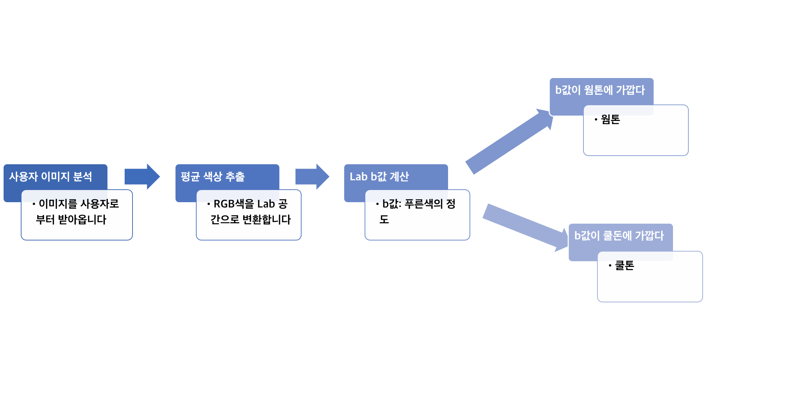

# Find your Personal Color
## 요약
자가진단 설문와 openCV를 활용한 퍼스널 컬러 찾아주는 React 기반의 웹 서비스

## 상세
### 1. 서비스
기존에 있는 퍼스널 컬러 진단 서비스는 대부분 사용자 이미지를 분석하고 퍼스널 컬러를 찾아주거나, 자가진단 설문을 통해 퍼스널 컬러를 알려주는 두 형태 중 한가지 형태로 진행되는 경우가 많았습니다. 저희는 두가지 서비스 모두를 구현하여 사용자들이 좀 더 정확한 퍼스널 컬러를 확인할 수 있도록 했습니다.

### 2. front

### 3. back

# 전체 서비스
// 전체 서비스 동작 이미지//

# 알고리즘
💻마더 프로젝트에서 가져온 알고리즘을 수정 및 개선하였습니다.💻

유저 이미지의 피부 사진을 가져와 평균 색깔을 추출합니다. 이를 토대로 이미지 RGB 값을 Lab 색 공간을 변환합니다. Lab b 값(푸른색의 정도)을 웜톤, 쿨톤의 스탠다드 값과의 거리를 계산하여 웜톤과 쿨톤을 구별합니다.

원본 알고리즘은 눈썹과 눈동자도 계산하여 가중치를 곱한 후, 계절을 구별하도록 하였는데, 이는 저희가 생각한 limit 정확도보다 떨어져서 계절 구별은 이미지 분석이 아닌 자가진단 설문에서만 구현했습니다.
또한, 원본 알고리즘은 웜톤과 쿨톤의 스탠다드 값을 연예인들의 이미지를 학습시켜 평균치를 구했는데, 본래 이미지를 통해서 확인하는 퍼스널 컬러는 조명, 화이트 밸런스, 화장 여부 등에 의해 영향을 많이 받기 때문에 이 부분을 수정하였습니다. 퍼스널 컬러 대표 색 이미지들의 Lab b값을 training시켜, 그 평균치를 스탠다드 값으로 업데이트 하였습니다. 

# 빌드 방법
## http://www.find-your-color.ml

# 사용 방법

# LICENSE
마더 프로젝트 https://github.com/starbucksdolcelatte/ShowMeTheColor.git